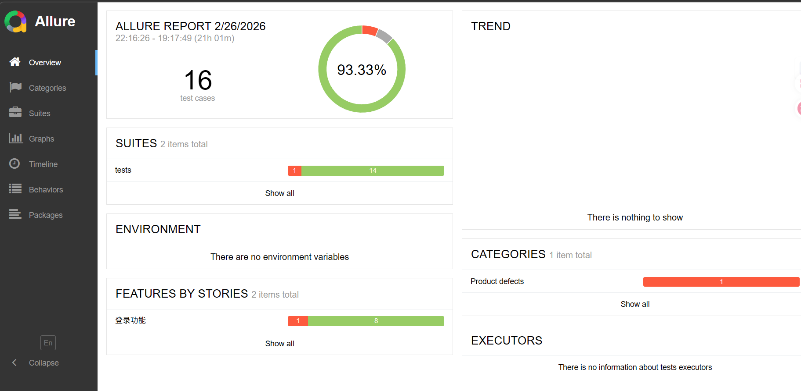
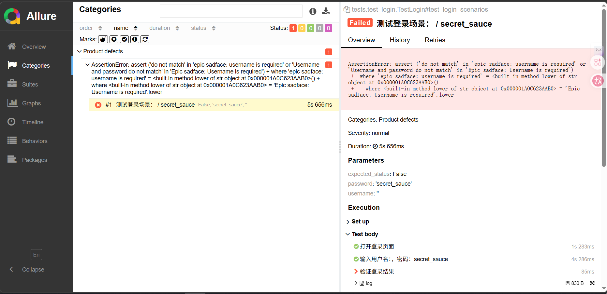
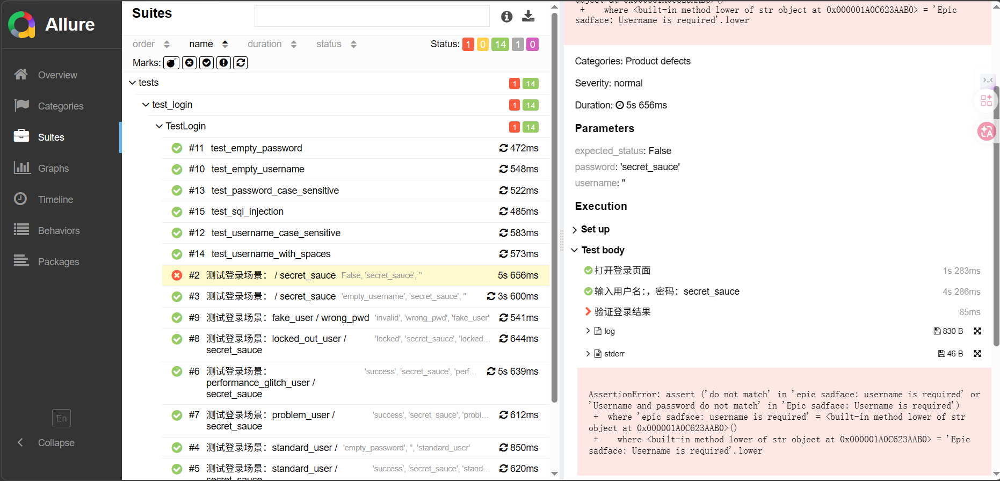
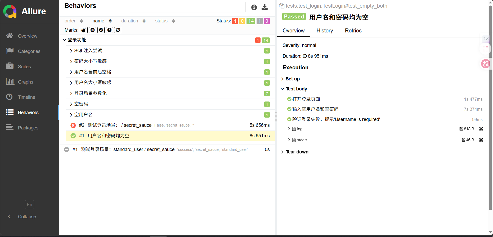
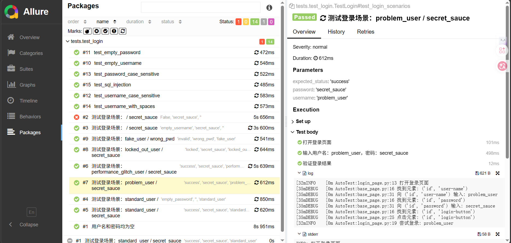

## 🛒 电商自动化测试框架 · SauceDemo

<p align="center">
  
</p>

<p align="center">
  <b>基于 Pytest + Selenium 的 UI 自动化测试框架，覆盖登录核心场景，支持失败截图、Allure 报告和类级别浏览器复用。</b>
</p>
<p align="center">
  <a href="https://www.python.org/downloads/"></a>
  <a href="https://docs.pytest.org/"></a>
  <a href="https://www.selenium.dev/"></a>
  <a href="https://allurereport.org/"></a>
  <a href="https://github.com/seleniumbase/SeleniumBase"></a>
  <a href="LICENSE"></a>
  <a href="https://gitee.com/yourname/ecommerce-auto-test/stargazers"></a>
</p>

<p align="center">
  <a href="#-项目简介">📖 简介</a> •
  <a href="#-核心亮点">✨ 亮点</a> •
  <a href="#-技术栈">🛠️ 技术栈</a> •
  <a href="#-快速开始">🚀 快速开始</a> •
  <a href="#-运行测试与查看报告">▶️ 运行测试</a> •
  <a href="#-项目结构">📂 结构</a> •
  <a href="#-常见问题排查">❓ 常见问题</a>
  <a href="#-测试报告预览">📸 报告预览</a> •
  <a href="#-许可证">📜 许可证</a>
</p>


---

## 📖 项目简介

本项目是一个轻量级 UI 自动化测试框架，针对公开电商网站 [SauceDemo](https://www.saucedemo.com) 的核心登录功能编写了 13 个测试用例，覆盖正常登录、异常场景、边界值、安全测试等。框架采用 **Page Object 设计模式**，支持数据驱动测试，并集成了失败截图和 Allure 报告，通过类级别浏览器复用将测试执行时间缩短近 **4 倍**（从 150 秒降至 40 秒）。

---

## ✨ 核心亮点

- ✅ **全面测试覆盖**：13 个测试用例（含正常/异常/边界/SQL注入等）
- ✅ **Page Object 模式**：页面元素与操作分离，提高代码复用性和可维护性
- ✅ **数据驱动测试**：通过 `@pytest.mark.parametrize` 实现多组数据批量执行
- ✅ **失败自动截图**：测试失败时自动截图并嵌入 Allure 报告，方便定位问题
- ✅ **Allure 报告**：生成美观、步骤清晰的测试报告
- ✅ **速度优化**：类级别浏览器复用，执行时间从 150 秒降至 40 秒
- ✅ **灵活配置**：通过 YAML 配置文件管理浏览器类型、超时时间等

---

## 🛠️ 技术栈

- **Python 3.8+** —— 核心编程语言
- **Pytest 8.0** —— 测试运行器
- **Selenium 4.18** —— Web 自动化驱动
- **Allure 2.32** —— 测试报告框架
- **webdriver-manager** —— 自动管理浏览器驱动
- **PyYAML** —— 配置文件解析

---

## 🚀 快速开始

### 1️⃣ 克隆项目
```bash
git clone https://gitee.com/yourname/ecommerce-auto-test.git
cd ecommerce-auto-test
```

### 2️⃣ 创建并激活虚拟环境
```bash
python -m venv venv
venv\Scripts\Activate.ps1		# Windows PowerShell
venv\Scripts\activate.bat		# Windows cmd
source venv/bin/activate		# macOS/Linux
```

### 3️⃣ 安装依赖
```bash
pip install -r requirements.txt
```

**`requirements.txt` 内容：**
```
selenium==4.18.1
pytest==8.0.2
pytest-html==4.1.1
pyyaml==6.0.1
webdriver-manager==4.0.1
allure-pytest==2.13.2
```

### 4️⃣ 配置浏览器驱动

#### 如果使用 **Edge** 浏览器（手动下载）：
- 打开 [Edge 驱动下载页](https://developer.microsoft.com/en-us/microsoft-edge/tools/webdriver/)
- 选择与你的 Edge 浏览器**完全一致**的版本（查看版本：浏览器输入 `edge://settings/help`）
- 下载 `edgedriver_win64.zip`，解压得到 `msedgedriver.exe`
- 在项目根目录新建 `drivers` 文件夹，将 `msedgedriver.exe` 放入
- 最终路径：`项目根目录/drivers/msedgedriver.exe`

#### 如果使用 **Chrome / Firefox**：
- 无需手动下载，`webdriver-manager` 会自动下载匹配的驱动。

### 5️⃣ 修改配置文件 `config/config.yaml`
```yaml
browser: "edge"          # 可选 chrome / firefox / edge
headless: false          # true 则浏览器无界面运行（适合 CI 环境）
timeout: 10              # 元素查找超时秒数
```

如果你使用 Chrome 或 Firefox，请将 `browser` 改为对应值。

---

## ▶️ 运行测试与查看报告

### 📌 准备工作（只需一次）
- 确保虚拟环境已激活（命令行前缀有 `(venv)`）
- 确保依赖已安装
- 确保浏览器驱动已就位（Edge 需手动放置）

### 📋 四种运行方式

| 方式                                                   | 命令                                                         | 说明                                                         |
| ------------------------------------------------------ | ------------------------------------------------------------ | ------------------------------------------------------------ |
| **方式一：纯控制台输出**                               | `pytest tests/test_login.py -v`                              | 仅控制台显示结果，失败截图保存在 `screenshots/`，**不生成报告文件**。 |
| **方式二：生成 HTML 报告**                             | `pytest tests/test_login.py -v --html=reports/report.html`   | 生成 `reports/report.html`，可用浏览器直接打开。             |
| **方式三：生成 Allure 数据**                           | `pytest tests/test_login.py -v --alluredir=./allure-results` | 生成 Allure 原始数据到 `allure-results` 文件夹，供后续查看。 |
| **方式四：使用 Python 脚本一键生成并查看 Allure 报告** | `python serve_report.py` 或 `python generate_report.py`      | 项目自带的两个脚本，简化 Allure 报告查看（见下文详细说明）。 |

---

### 📊 查看报告

#### 🔹 查看 HTML 报告（方式二）
- 直接双击打开 `reports/report.html` 即可。

#### 🔹 查看 Allure 报告（方式三、四）

##### 方法一：命令行查看（需安装 Allure）
1. **安装 Allure**（只需一次）：
   - Windows 推荐用 scoop：
     ```powershell
     Set-ExecutionPolicy RemoteSigned -Scope CurrentUser
     irm get.scoop.sh | iex
     scoop install allure
     ```
   - 手动下载：从 [Allure Releases](https://github.com/allure-framework/allure2/releases) 下载 `allure-2.32.0.zip`，解压到 `C:\allure`，将 `C:\allure\bin` 加入系统环境变量 PATH。
   - 验证安装：`allure --version`

2. **查看报告**：
   ```bash
   allure serve ./allure-results
   ```

##### 方法二：使用项目自带脚本（推荐，无需记忆命令）

**脚本 1：`serve_report.py`**（直接启动 Allure 服务）
```python
import os
import subprocess
# 修改为你的 Allure 实际安装路径（到 bin 目录）
allure_bin_dir = r"C:\Users\你的用户名\Desktop\DEAR\gupn\allure\bin"
allure_cmd = os.path.join(allure_bin_dir, "allure.bat")
subprocess.run([allure_cmd, "serve", "./allure-results"])
```
运行：`python serve_report.py`

确保已运行方式三生成 `allure-results` 文件夹，较为建议使用`generate_report.py`

**脚本 2：`generate_report.py`**（生成静态 HTML 报告并打开）

```python
import os
import subprocess
import webbrowser
# 修改为你的 Allure 实际安装路径（只需第一次）
allure_bin_dir = r"C:\Users\你的用户名\Desktop\DEAR\gupn\allure\bin"
allure_cmd = os.path.join(allure_bin_dir, "allure.bat")
results_dir = "./allure-results"
output_dir = "./reports/allure-report"

os.makedirs(output_dir, exist_ok=True)
subprocess.run([allure_cmd, "generate", results_dir, "-o", output_dir, "--clean"])
report_index = os.path.join(output_dir, "index.html")
webbrowser.open(report_index)
print(f"报告已生成：{report_index}")
```
运行：`python generate_report.py`  
生成的静态报告保存在 `reports/allure-report/`，以后可直接打开 `index.html`（但直接打开可能因浏览器限制无法加载，建议用脚本或 `allure serve`）。

---

## 📂 项目结构

```
ecommerce-auto-test/
├── config/               # 配置文件
│   └── config.yaml
├── drivers/              # 手动放置的浏览器驱动（可选）
├── pages/                # 页面对象
│   ├── base_page.py      # 页面基类
│   └── login_page.py     # 登录页面
├── tests/                # 测试用例
│   ├── conftest.py       # pytest fixture
│   └── test_login.py     # 登录测试（13个用例）
├── utils/                # 工具类
│   ├── driver_factory.py # 浏览器驱动工厂
│   └── logger.py         # 日志封装
├── reports/              # 测试报告输出
├── screenshots/          # 失败截图
├── serve_report.py       # 脚本：启动 Allure 服务
├── generate_report.py    # 脚本：生成静态报告
├── requirements.txt      # 依赖列表
└── README.md             # 本文档
```

------

### 📌 常用命令速查表

| 目的                               | 命令                                                         |
| ---------------------------------- | ------------------------------------------------------------ |
| 激活虚拟环境（Windows PowerShell） | `venv\Scripts\Activate.ps1`                                  |
| 安装依赖                           | `pip install -r requirements.txt`                            |
| 运行所有登录测试（控制台）         | `pytest tests/test_login.py -v`                              |
| 运行并生成 HTML 报告               | `pytest tests/test_login.py -v --html=reports/report.html`   |
| 运行并生成 Allure 数据             | `pytest tests/test_login.py -v --alluredir=./allure-results` |
| 查看 Allure 报告（命令行）         | `allure serve ./allure-results`                              |
| 运行脚本查看 Allure 报告           | `python serve_report.py` 或 `python generate_report.py`      |

------

## ❓ 常见问题排查

| 问题现象                                     | 可能原因                             | 解决方法                                                     |
| -------------------------------------------- | ------------------------------------ | ------------------------------------------------------------ |
| **驱动找不到**（如 `NoSuchDriverException`） | Edge 驱动未手动放置，或路径不对      | 确认 `drivers/msedgedriver.exe` 存在；或临时改用 Chrome（修改 `config.yaml` 中 `browser: "chrome"`） |
| **浏览器一闪而过，测试报错**                 | 驱动版本与浏览器不匹配               | 检查 Edge 版本，重新下载对应驱动                             |
| **测试全部失败，提示元素找不到**             | 页面加载超时，或网络慢               | 在 `config.yaml` 中增大 `timeout` 值（如改为 20）            |
| **`allure` 命令找不到**                      | Allure 未安装，或未添加到 PATH       | 用脚本方式运行；或安装后重启终端，或使用绝对路径             |
| **直接打开 `index.html` 报告空白**           | 浏览器安全限制（CORS）               | 使用 `allure serve` 或通过脚本方式查看                       |
| **虚拟环境激活失败（PowerShell）**           | 执行策略限制                         | 以管理员身份运行 PowerShell，执行：`Set-ExecutionPolicy RemoteSigned` |
| **测试失败但无截图**                         | `conftest.py` 中的截图钩子未正确配置 | 检查 `pytest_runtest_makereport` 函数是否在 `conftest.py` 中，且能获取到 `driver` 实例 |
| **依赖安装报错**                             | 网络问题或 Python 版本不匹配         | 使用国内镜像：`pip install -r requirements.txt -i https://pypi.tuna.tsinghua.edu.cn/simple` |
| **多线程运行冲突**                           | 测试间相互影响                       | 默认已隔离（每个类独立浏览器），如需并发可自行研究 `pytest-xdist`，但需注意驱动冲突 |

---

## 📸 测试报告预览

### 失败截图自动嵌入

测试失败时，截图会自动保存到 `screenshots/` 并附加到 Allure 报告中。

### Allure 报告示例



<p align="center">
  Allure Overview
</p>


<p align="center">
  Failed Test
</p>


<p align="center">
  Suites
</p>



<p align="center">
  Behaviors
</p>



<p align="center">
  Packages
</p>

---

## 📜 许可证

本项目基于 MIT 许可证开源，详情请参阅 [LICENSE](LICENSE) 文件。

---

<p align="center">
  <sub>Built with ❤️ by Bbeginner</sub>
  <br>
  <a href="https://gitee.com/yourname/ecommerce-auto-test"></a>
</p>